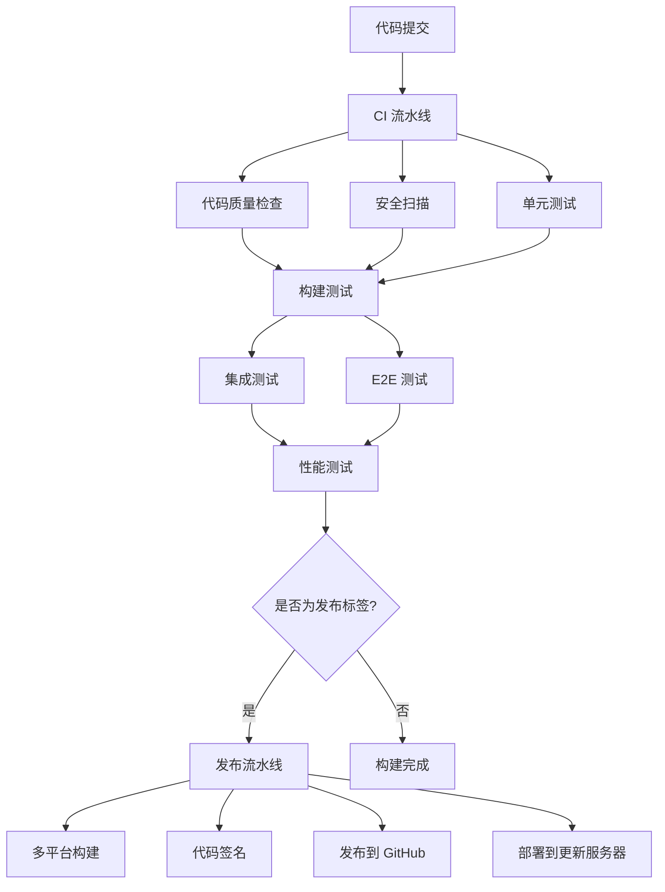

# MingLog 桌面客户端 CI/CD 流水线指南

## 概述

本指南详细说明了 MingLog 桌面客户端的 CI/CD 流水线配置，包括自动化构建、测试、质量检查和发布流程。

## 流水线架构

### 工作流概览



### 核心工作流

1. **CI 流水线** (`ci.yml`)
   - 代码质量检查
   - 安全扫描
   - 单元测试
   - 构建测试
   - E2E 测试
   - 性能测试

2. **发布流水线** (`release.yml`)
   - 多平台构建
   - 代码签名
   - 创建 GitHub Release
   - 部署到更新服务器

3. **质量门禁** (`quality-gates.yml`)
   - 代码格式检查
   - 代码分析
   - 安全扫描
   - 依赖检查
   - 复杂度分析

## 触发条件

### CI 流水线触发
- **Push 到主分支**: `main`, `develop`
- **Pull Request**: 针对 `main`, `develop` 分支
- **标签推送**: `v*` 格式的版本标签

### 发布流水线触发
- **版本标签**: `v*` 格式（如 `v1.0.0`）
- **手动触发**: 通过 GitHub Actions 界面

### 质量门禁触发
- **所有 Pull Request**
- **主分支推送**
- **手动触发**

## 环境配置

### 开发环境 (Development)
```yaml
NODE_ENV: development
LOG_LEVEL: debug
API_BASE_URL: https://dev-api.minglog.com
UPDATE_SERVER_URL: https://dev-updates.minglog.com
SENTRY_ENVIRONMENT: development
ENABLE_DEVTOOLS: true
```

### 预发布环境 (Staging)
```yaml
NODE_ENV: staging
LOG_LEVEL: info
API_BASE_URL: https://staging-api.minglog.com
UPDATE_SERVER_URL: https://staging-updates.minglog.com
SENTRY_ENVIRONMENT: staging
ENABLE_DEVTOOLS: false
```

### 生产环境 (Production)
```yaml
NODE_ENV: production
LOG_LEVEL: warn
API_BASE_URL: https://api.minglog.com
UPDATE_SERVER_URL: https://updates.minglog.com
SENTRY_ENVIRONMENT: production
ENABLE_DEVTOOLS: false
```

## 秘密配置

### 必需的 GitHub Secrets

#### 通用秘密
- `TAURI_PRIVATE_KEY`: Tauri 更新签名私钥
- `TAURI_KEY_PASSWORD`: Tauri 私钥密码
- `SENTRY_DSN`: Sentry 项目 DSN
- `SENTRY_AUTH_TOKEN`: Sentry API 令牌

#### Windows 代码签名
- `WINDOWS_CERTIFICATE`: Windows 代码签名证书 (Base64)
- `WINDOWS_CERTIFICATE_PASSWORD`: 证书密码

#### macOS 代码签名
- `MACOS_CERTIFICATE`: macOS 代码签名证书 (Base64)
- `MACOS_CERTIFICATE_PASSWORD`: 证书密码
- `APPLE_ID`: Apple ID
- `APPLE_PASSWORD`: App 专用密码
- `APPLE_TEAM_ID`: Apple 开发者团队 ID

#### 部署配置
- `UPDATE_SERVER_HOST`: 更新服务器主机
- `UPDATE_SERVER_USER`: 更新服务器用户
- `UPDATE_SERVER_KEY`: 更新服务器 SSH 私钥

#### 通知配置
- `SLACK_WEBHOOK_URL`: Slack 通知 Webhook

### 环境特定秘密

#### Staging 环境
- `STAGING_WINDOWS_CERTIFICATE`: 测试环境 Windows 证书
- `STAGING_MACOS_CERTIFICATE`: 测试环境 macOS 证书

## 多平台构建

### 支持的平台

| 平台 | 架构 | 运行器 | 输出格式 |
|------|------|--------|----------|
| Windows | x64 | windows-latest | .msi, .exe |
| Windows | ARM64 | windows-latest | .msi, .exe |
| macOS | x64 | macos-latest | .dmg, .app |
| macOS | ARM64 | macos-latest | .dmg, .app |
| Linux | x64 | ubuntu-latest | .AppImage, .deb, .rpm |
| Linux | ARM64 | ubuntu-latest | .AppImage, .deb, .rpm |

### 构建矩阵配置

```yaml
strategy:
  matrix:
    include:
      - platform: windows
        runner: windows-latest
        arch: x64
        target: x86_64-pc-windows-msvc
      - platform: macos
        runner: macos-latest
        arch: x64
        target: x86_64-apple-darwin
      - platform: linux
        runner: ubuntu-latest
        arch: x64
        target: x86_64-unknown-linux-gnu
```

## 测试策略

### 测试类型

1. **单元测试**
   - Rust: `cargo test`
   - Frontend: `npm test`
   - 覆盖率要求: ≥80%

2. **集成测试**
   - 数据库集成
   - API 集成
   - 组件集成

3. **E2E 测试**
   - Playwright 自动化测试
   - 跨平台测试
   - 用户场景测试

4. **性能测试**
   - 启动时间测试
   - 内存使用测试
   - 响应时间测试

### 测试并行化

- **平台并行**: 同时在多个操作系统上运行
- **测试并行**: 单元测试和集成测试并行执行
- **分片测试**: E2E 测试按功能模块分片

## 质量门禁

### 代码质量标准

1. **格式检查**
   - Rust: `cargo fmt --check`
   - TypeScript: `eslint` + `prettier`

2. **静态分析**
   - Rust: `cargo clippy`
   - TypeScript: `@typescript-eslint`

3. **安全扫描**
   - Rust: `cargo audit`
   - npm: `npm audit`
   - Semgrep 安全扫描

4. **复杂度分析**
   - 圈复杂度检查
   - 文件大小限制
   - 依赖分析

### 质量阈值

| 指标 | 标准模式 | 严格模式 |
|------|----------|----------|
| 代码覆盖率 | ≥80% | ≥90% |
| 圈复杂度 | ≤10 | ≤8 |
| 文件大小 | ≤500行 | ≤300行 |
| 安全漏洞 | 高危 | 中危 |

## 发布流程

### 版本发布步骤

1. **创建版本标签**
   ```bash
   git tag v1.0.0
   git push origin v1.0.0
   ```

2. **自动触发发布流水线**
   - 多平台构建
   - 代码签名
   - 创建 GitHub Release

3. **发布验证**
   - 下载链接验证
   - 签名验证
   - 安装测试

4. **部署到更新服务器**
   - 上传安装包
   - 更新版本信息
   - 通知用户

### 发布渠道

- **Stable**: 稳定版本，面向所有用户
- **Beta**: 测试版本，面向测试用户
- **Alpha**: 开发版本，面向开发者

## 监控和通知

### 构建监控

- **构建状态**: GitHub Actions 状态徽章
- **测试结果**: 测试报告和覆盖率报告
- **性能指标**: 构建时间和资源使用

### 通知机制

- **Slack 通知**: 构建成功/失败通知
- **邮件通知**: 发布完成通知
- **GitHub 通知**: PR 状态更新

## 故障排除

### 常见问题

#### 构建失败
1. **依赖问题**: 检查 `package.json` 和 `Cargo.toml`
2. **环境问题**: 验证系统依赖安装
3. **权限问题**: 检查 GitHub Secrets 配置

#### 测试失败
1. **单元测试**: 检查代码逻辑和测试用例
2. **E2E 测试**: 验证应用构建和 Playwright 配置
3. **性能测试**: 检查性能阈值设置

#### 发布失败
1. **代码签名**: 验证证书配置和有效期
2. **上传失败**: 检查网络连接和权限
3. **部署失败**: 验证服务器配置和 SSH 密钥

### 调试技巧

1. **启用调试日志**
   ```yaml
   env:
     RUST_LOG: debug
     ACTIONS_STEP_DEBUG: true
   ```

2. **保留构建产物**
   ```yaml
   - uses: actions/upload-artifact@v3
     if: failure()
     with:
       name: debug-logs
       path: logs/
   ```

3. **SSH 调试**
   ```yaml
   - name: Setup tmate session
     if: failure()
     uses: mxschmitt/action-tmate@v3
   ```

## 最佳实践

### 性能优化

1. **缓存策略**
   - Rust 编译缓存
   - npm 依赖缓存
   - Docker 层缓存

2. **并行执行**
   - 测试并行化
   - 构建矩阵优化
   - 资源合理分配

3. **增量构建**
   - 只构建变更部分
   - 智能测试选择
   - 条件执行

### 安全考虑

1. **秘密管理**
   - 使用 GitHub Secrets
   - 定期轮换密钥
   - 最小权限原则

2. **代码安全**
   - 定期安全扫描
   - 依赖漏洞检查
   - 代码审查

3. **构建安全**
   - 隔离构建环境
   - 验证构建产物
   - 安全的部署流程

通过遵循本指南，可以确保 MingLog 桌面客户端的 CI/CD 流水线高效、安全且可靠。
