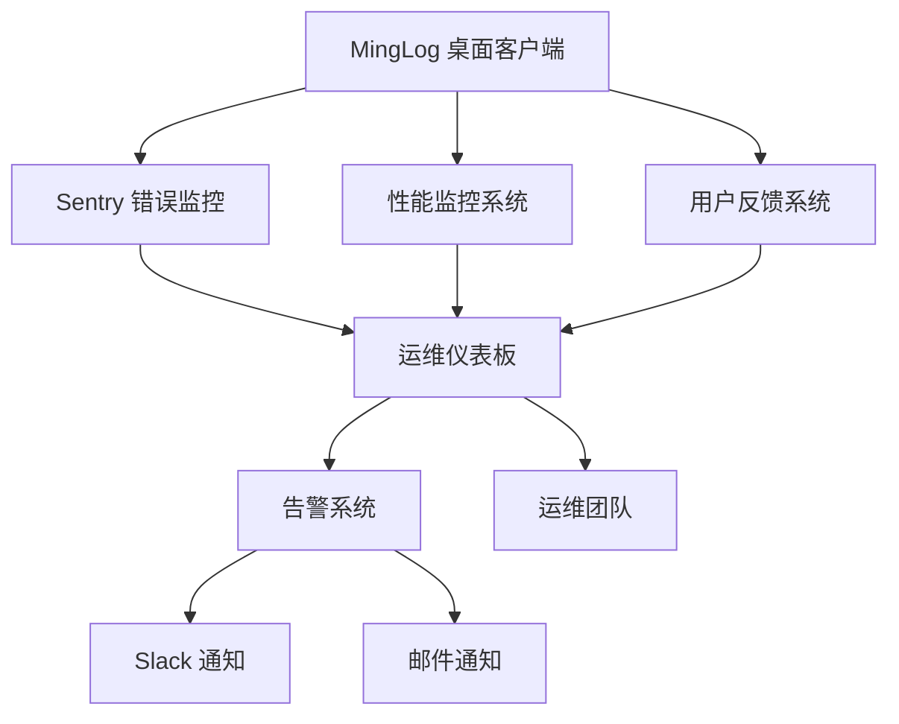

# MingLog 桌面客户端生产环境监控指南

## 概述

本指南详细说明了 MingLog 桌面客户端生产环境监控系统的配置、使用和维护，包括错误监控、性能监控、用户反馈收集和运维仪表板。

## 监控架构

### 监控组件架构



### 核心监控功能

1. **错误监控 (Sentry)**
   - 实时错误捕获和报告
   - 错误分类和优先级管理
   - 性能事务跟踪
   - 用户会话监控

2. **性能监控 (APM)**
   - 系统资源监控 (CPU、内存、磁盘、网络)
   - 应用性能指标收集
   - 响应时间统计
   - 性能告警机制

3. **用户反馈系统**
   - 多类型反馈收集
   - 反馈分析和统计
   - 自动化处理流程
   - 客服系统集成

4. **运维仪表板**
   - 实时监控数据展示
   - 多维度数据分析
   - 告警状态管理
   - 历史趋势分析

## Sentry 错误监控配置

### 1. Sentry 项目设置

#### 创建 Sentry 项目
```bash
# 1. 登录 Sentry 控制台
# 2. 创建新项目，选择 "Rust" 平台
# 3. 获取 DSN 和 Auth Token
```

#### 环境配置
```yaml
# 生产环境配置
SENTRY_DSN: "https://your-dsn@sentry.io/project-id"
SENTRY_ENVIRONMENT: "production"
SENTRY_RELEASE: "minglog-desktop@1.0.0"
SENTRY_AUTH_TOKEN: "your-auth-token"
```

### 2. 错误监控配置

#### 基础配置
```rust
SentryConfig {
    dsn: "https://your-dsn@sentry.io/project-id".to_string(),
    environment: "production".to_string(),
    release: "1.0.0".to_string(),
    sample_rate: 1.0,              // 100% 错误采样
    traces_sample_rate: 0.1,       // 10% 性能追踪
    profiles_sample_rate: 0.1,     // 10% 性能分析
    max_breadcrumbs: 100,
    attach_stacktrace: true,
    send_default_pii: false,       // 不发送个人信息
    auto_session_tracking: true,
    enable_profiling: true,
}
```

#### 告警规则配置
- **高优先级错误**: 立即通知
- **性能异常**: CPU > 85%, 内存 > 90%
- **错误率阈值**: 每小时 > 100 个错误
- **响应时间**: 平均响应时间 > 5 秒

### 3. 性能监控集成

#### 事务跟踪
```rust
// 数据库操作跟踪
let transaction = sentry_manager.start_transaction("database", "query");
// ... 执行数据库操作
transaction.finish();

// 文件操作跟踪
let transaction = sentry_manager.start_transaction("file", "read");
// ... 执行文件操作
transaction.finish();
```

#### 自定义指标
```rust
// 设置用户上下文
sentry_manager.set_user(Some(user_id), Some(email));

// 添加自定义标签
sentry_manager.set_tag("feature", "note_editor");

// 添加面包屑
sentry_manager.add_breadcrumb("用户创建笔记", "user_action", sentry::Level::Info);
```

## 性能监控系统

### 1. 系统指标监控

#### 监控指标
- **CPU 使用率**: 实时 CPU 使用百分比
- **内存使用**: 已用内存 / 总内存
- **磁盘使用**: 各分区使用情况
- **网络统计**: 发送/接收字节数和包数

#### 应用指标
- **启动时间**: 应用启动耗时
- **响应时间**: 各操作的响应时间分布
- **错误计数**: 累计错误数量
- **活跃用户**: 当前在线用户数
- **数据库连接**: 活跃连接数
- **缓存命中率**: 缓存效率统计

### 2. 性能告警配置

#### 告警阈值
```yaml
cpu_usage:
  warning: 70%
  critical: 85%

memory_usage:
  warning: 80%
  critical: 90%

disk_usage:
  warning: 85%
  critical: 95%

error_count:
  warning: 50/hour
  critical: 100/hour

response_time:
  warning: 3s
  critical: 5s
```

#### 告警处理流程
1. **检测异常**: 自动检测性能指标异常
2. **分级告警**: 根据严重程度分级处理
3. **通知发送**: Slack/邮件通知运维团队
4. **自动恢复**: 尝试自动恢复措施
5. **人工介入**: 严重问题人工处理

### 3. 性能优化建议

#### 自动优化
- **内存清理**: 定期清理无用内存
- **缓存管理**: 智能缓存策略
- **连接池**: 数据库连接池优化
- **资源回收**: 及时释放系统资源

#### 性能分析
- **热点分析**: 识别性能瓶颈
- **趋势分析**: 性能变化趋势
- **对比分析**: 版本间性能对比
- **用户影响**: 性能对用户体验的影响

## 用户反馈系统

### 1. 反馈收集机制

#### 反馈类型
- **错误报告**: 软件缺陷和异常
- **功能请求**: 新功能需求
- **改进建议**: 现有功能改进
- **问题咨询**: 使用问题咨询
- **表扬反馈**: 正面用户反馈
- **投诉建议**: 负面用户反馈

#### 反馈优先级
- **Critical**: 严重影响使用的问题
- **High**: 重要功能问题
- **Medium**: 一般性问题
- **Low**: 优化建议

### 2. 反馈处理流程

#### 自动化处理
1. **反馈接收**: 自动接收和分类
2. **优先级评估**: 自动评估优先级
3. **分配处理**: 自动分配给相关团队
4. **状态跟踪**: 实时跟踪处理状态
5. **用户通知**: 自动通知处理进展

#### 人工处理
1. **问题分析**: 技术团队分析问题
2. **解决方案**: 制定解决方案
3. **实施修复**: 实施修复措施
4. **验证测试**: 验证修复效果
5. **用户反馈**: 收集用户满意度

### 3. 反馈分析统计

#### 统计维度
- **反馈数量**: 总数和趋势分析
- **类型分布**: 各类型反馈占比
- **优先级分布**: 各优先级问题分布
- **处理状态**: 处理进度统计
- **解决时间**: 平均解决时间
- **满意度**: 用户满意度评分

#### 分析报告
- **周报**: 每周反馈处理报告
- **月报**: 月度反馈趋势分析
- **季报**: 季度用户满意度报告
- **年报**: 年度产品改进报告

## 运维监控仪表板

### 1. 仪表板功能

#### 实时监控
- **系统状态**: 实时系统健康状态
- **性能指标**: 关键性能指标展示
- **错误统计**: 错误数量和趋势
- **用户活动**: 用户活跃度统计

#### 历史分析
- **趋势图表**: 各指标历史趋势
- **对比分析**: 不同时期数据对比
- **异常检测**: 异常事件识别
- **容量规划**: 资源使用预测

### 2. 告警管理

#### 告警配置
```yaml
alerts:
  cpu_high:
    threshold: 85%
    duration: 5m
    severity: warning
    
  memory_critical:
    threshold: 90%
    duration: 2m
    severity: critical
    
  error_rate_high:
    threshold: 100/hour
    duration: 10m
    severity: warning
```

#### 通知渠道
- **Slack**: 实时团队通知
- **邮件**: 详细告警邮件
- **短信**: 紧急情况短信通知
- **电话**: 严重故障电话通知

### 3. 运维响应流程

#### 告警响应
1. **告警接收**: 自动接收告警信息
2. **问题评估**: 快速评估问题严重性
3. **应急响应**: 启动应急响应流程
4. **问题解决**: 实施解决措施
5. **恢复验证**: 验证系统恢复正常
6. **事后分析**: 分析问题原因和改进

#### 值班制度
- **7x24 监控**: 全天候监控覆盖
- **分级响应**: 不同级别问题不同响应时间
- **轮班制度**: 运维人员轮班值守
- **升级机制**: 问题升级处理机制

## 部署和配置

### 1. 生产环境部署

#### 环境要求
- **操作系统**: Windows 10+, macOS 10.15+, Ubuntu 18.04+
- **内存**: 最低 4GB，推荐 8GB+
- **磁盘**: 最低 10GB 可用空间
- **网络**: 稳定的互联网连接

#### 配置文件
```toml
# monitoring.toml
[sentry]
dsn = "https://your-dsn@sentry.io/project-id"
environment = "production"
sample_rate = 1.0
traces_sample_rate = 0.1

[performance]
collection_interval = 30
max_history_size = 1000
enable_profiling = true

[feedback]
auto_submit = true
api_endpoint = "https://api.minglog.com/feedback"
```

### 2. 监控数据存储

#### 本地存储
- **性能数据**: 本地 SQLite 数据库
- **反馈数据**: 本地 JSON 文件
- **日志文件**: 结构化日志文件

#### 云端同步
- **Sentry**: 错误和性能数据
- **API 服务**: 反馈数据同步
- **对象存储**: 大文件和附件

### 3. 数据隐私保护

#### 隐私策略
- **最小化收集**: 只收集必要的监控数据
- **匿名化处理**: 敏感信息匿名化
- **用户同意**: 明确的用户同意机制
- **数据加密**: 传输和存储加密

#### 合规要求
- **GDPR**: 欧盟数据保护法规
- **CCPA**: 加州消费者隐私法
- **本地法规**: 各地区数据保护法规

## 维护和优化

### 1. 定期维护

#### 日常维护
- **数据清理**: 定期清理过期数据
- **性能优化**: 监控系统性能优化
- **配置更新**: 根据需要更新配置
- **安全检查**: 定期安全检查

#### 定期评估
- **监控效果**: 评估监控系统效果
- **告警准确性**: 评估告警准确性
- **用户满意度**: 评估用户满意度
- **系统改进**: 持续改进监控系统

### 2. 故障排除

#### 常见问题
- **数据丢失**: 监控数据丢失处理
- **告警误报**: 告警误报问题解决
- **性能下降**: 监控系统性能问题
- **网络问题**: 网络连接问题处理

#### 应急预案
- **系统故障**: 监控系统故障应急预案
- **数据恢复**: 数据丢失恢复预案
- **服务降级**: 服务降级处理预案
- **灾难恢复**: 灾难恢复预案

通过遵循本指南，可以确保 MingLog 桌面客户端的生产环境监控系统稳定、高效、安全地运行，为用户提供优质的服务体验。
