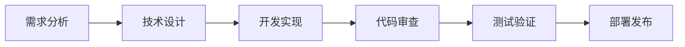

# 📋 项目管理指南

## 🎯 项目概览

### 项目信息
- **项目名称**: MingLog
- **项目类型**: 现代化知识管理工具
- **技术栈**: TypeScript + React + Tauri
- **团队规模**: 1-5人
- **预计周期**: 20-30周

### 项目目标
- 🚀 性能提升70%以上
- 🛠️ 改善开发体验
- 🏗️ 建立可扩展架构
- 🔧 保持功能兼容性

---

## 📅 里程碑规划

### 🏁 里程碑1: 基础架构 (已完成)
**时间**: 第1-4周
**状态**: ✅ 完成

**交付物**:
- [x] 项目结构设计
- [x] 技术栈选择
- [x] 开发环境配置
- [x] 基础组件库
- [x] 数据库设计

### 🏁 里程碑2: 核心功能
**时间**: 第5-14周
**状态**: 🔄 进行中

**交付物**:
- [ ] 完整的块编辑器
- [ ] 数据持久化系统
- [ ] 搜索引擎集成
- [ ] 页面管理功能
- [ ] 用户界面优化

### 🏁 里程碑3: 高级功能
**时间**: 第15-22周
**状态**: 📅 计划中

**交付物**:
- [ ] 图谱可视化
- [ ] 插件系统
- [ ] 实时协作
- [ ] 性能优化

### 🏁 里程碑4: 桌面应用
**时间**: 第23-28周
**状态**: 📅 计划中

**交付物**:
- [ ] Tauri集成
- [ ] 原生功能
- [ ] 打包分发
- [ ] 自动更新

---

## 📊 任务管理

### 当前Sprint (第5-6周)
**主题**: 编辑器增强
**目标**: 完善块编辑器的核心功能

#### 🔥 高优先级任务
- [ ] **块编辑器性能优化** (3天)
  - 负责人: 开发者A
  - 状态: 进行中
  - 截止日期: 2024-01-15

- [ ] **双向链接系统** (5天)
  - 负责人: 开发者B
  - 状态: 未开始
  - 截止日期: 2024-01-20

#### 🔶 中优先级任务
- [ ] **块引用功能** (4天)
  - 负责人: 开发者A
  - 状态: 未开始
  - 截止日期: 2024-01-25

- [ ] **拖拽重排序** (2天)
  - 负责人: 开发者C
  - 状态: 未开始
  - 截止日期: 2024-01-22

#### 🔷 低优先级任务
- [ ] **键盘快捷键** (1天)
  - 负责人: 开发者C
  - 状态: 未开始
  - 截止日期: 2024-01-30

### 下一Sprint (第7-8周)
**主题**: 数据持久化
**计划任务**:
- Prisma性能优化
- 数据迁移系统
- 备份恢复功能

---

## 👥 团队协作

### 角色分工
- **项目负责人**: 整体规划和协调
- **前端开发**: React组件和UI实现
- **后端开发**: 数据库和API设计
- **测试工程师**: 自动化测试和质量保证
- **UI/UX设计师**: 界面设计和用户体验

### 协作流程

#### 📝 需求管理
1. **需求收集**: 通过GitHub Issues收集需求
2. **需求评估**: 团队讨论可行性和优先级
3. **需求拆分**: 将大需求拆分为可执行任务
4. **需求跟踪**: 使用项目看板跟踪进度

#### 🔄 开发流程


#### 🧪 质量保证
- **代码审查**: 所有PR必须经过审查
- **自动化测试**: 单元测试覆盖率>90%
- **性能测试**: 关键指标不能回退
- **用户测试**: 定期收集用户反馈

---

## 📈 进度跟踪

### 完成度统计
```
总体进度: ████████░░ 80%

阶段1 (基础架构): ██████████ 100%
阶段2 (核心功能): ████░░░░░░ 40%
阶段3 (高级功能): ░░░░░░░░░░ 0%
阶段4 (桌面应用): ░░░░░░░░░░ 0%
```

### 关键指标
| 指标 | 目标 | 当前 | 状态 |
|------|------|------|------|
| 代码覆盖率 | >90% | 85% | 🔶 |
| 构建时间 | <30s | 25s | ✅ |
| 包大小 | <50MB | 45MB | ✅ |
| 启动时间 | <3s | 2.5s | ✅ |

### 风险评估
| 风险 | 概率 | 影响 | 缓解措施 |
|------|------|------|----------|
| 技术难度超预期 | 中 | 高 | 增加技术调研时间 |
| 性能目标未达成 | 低 | 高 | 提前进行性能测试 |
| 团队成员变动 | 低 | 中 | 完善文档和知识分享 |

---

## 🔧 工具和流程

### 开发工具
- **代码管理**: Git + GitHub
- **项目管理**: GitHub Projects
- **CI/CD**: GitHub Actions
- **代码质量**: ESLint + Prettier
- **测试**: Vitest + Playwright

### 沟通工具
- **日常沟通**: Slack/Discord
- **会议**: Zoom/Teams
- **文档**: Markdown + GitHub Wiki
- **设计**: Figma

### 工作流程

#### 🌅 每日站会 (15分钟)
- 昨天完成的工作
- 今天计划的工作
- 遇到的问题和阻碍

#### 📅 Sprint规划 (2小时)
- 回顾上个Sprint
- 规划下个Sprint任务
- 估算工作量

#### 🔍 代码审查流程
1. 创建Pull Request
2. 自动化测试通过
3. 至少一人审查代码
4. 解决审查意见
5. 合并到主分支

---

## 📋 检查清单

### 🚀 发布前检查
- [ ] 所有测试通过
- [ ] 性能指标达标
- [ ] 安全漏洞扫描
- [ ] 文档更新完成
- [ ] 用户反馈收集

### 🔄 Sprint检查
- [ ] 任务完成情况
- [ ] 代码质量指标
- [ ] 技术债务评估
- [ ] 团队反馈收集

### 📊 质量检查
- [ ] 代码覆盖率>90%
- [ ] 无严重Bug
- [ ] 性能回归测试
- [ ] 用户体验测试

---

## 📚 文档管理

### 文档结构
```
docs/
├── README.md              # 项目概述
├── development.md         # 开发指南
├── architecture.md        # 架构设计
├── roadmap.md            # 开发路线图
├── development-prompts.md # 开发提示词
├── project-management.md  # 项目管理
├── api/                  # API文档
├── components/           # 组件文档
└── deployment/           # 部署文档
```

### 文档维护
- **更新频率**: 每周更新
- **责任人**: 项目负责人
- **审查流程**: PR审查
- **版本控制**: Git管理

---

## 🎯 成功标准

### 技术指标
- ✅ 启动时间<3秒
- ✅ 内存占用<150MB
- ✅ 构建时间<30秒
- 🔄 测试覆盖率>90%
- 🔄 零严重安全漏洞

### 业务指标
- 📅 用户满意度>4.5/5
- 📅 功能完整度>95%
- 📅 性能提升>70%
- 📅 开发效率提升>50%

### 团队指标
- 📅 按时交付率>90%
- 📅 代码质量评分>8/10
- 📅 团队满意度>4/5
- 📅 知识分享次数>10次

这个项目管理指南为Logseq Next的开发提供了完整的管理框架，确保项目能够按计划高质量交付。
